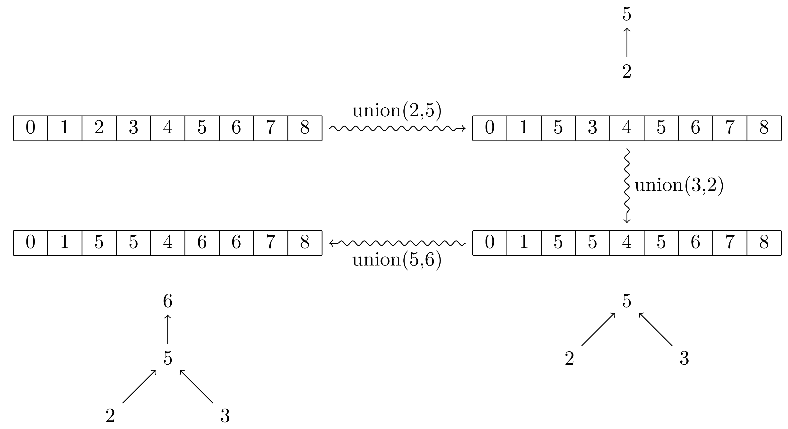

# Recherche de seuil de percolation - une application d'Union-Find

*Cet exercice est une très légère adaptation du premier TD du cours INF371 du tronc commun du cycle ingénieur de l'École Polytechnique prodigué par Benjamin Werner. Il a été conçu par Benjamin Werner, Julien Signoles, Sylvie Putot et Xavier Rival qui en conserve l'entière propriété.* 

## Introduction

L’objectif de cet exercice est de déterminer s’il y a ou non percolation à travers une grille du plan pavée de cases noires et blanches, c’est-à-dire s’il existe ou non un chemin de cases noires allant du haut au bas d’une telle grille. Ensuite, il s’agira d’estimer la proportion de cases noires nécessaires à ce qu’il y ait percolation. Cette proportion est appelée le seuil de percolation.

Pour cela, vous aurez à réaliser un programme, découpé en petites fonctions élémentaires, que vous optimiserez ensuite étape par étape en étant guidé(e) par le sujet. N’oubliez pas de tester les fonctionnalités que vous écrivez chaque fois que possible, et au fur et à mesure !

Vous manipulerez ici les fonctions et structures de contrôle classiques de Python, et vous y ferez un usage intensif des listes (entiers et booléens) et des instructions de contrôle fondamentales. Vous programmerez notamment une structure de données appelée Union-Find permettant de représenter efficacement des classes d’équivalence à l’aide de leurs représentants canoniques. Elle permet d’optimiser la résolution de certains problèmes dans des domaines variés, par exemple en théorie des graphes ou en preuve automatique.

Avant de continuer il est vivement conseillé de regarder les deux vidéos suivantes réalisées par Benjamin Werner : 

- *lien*
- *lien*

## Seuil de percolation

Nous allons calculer une valeur approchée du seuil de percolation d’un chemin de haut en bas dans une matrice contenant des cases noires et blanches. Pour ce faire, nous allons noircir aléatoirement des cases et, après chaque étape, nous allons détecter s’il existe un chemin fait de cases noires allant d’une case quelconque du haut (première ligne) à une case quelconque du bas (dernière ligne) de la matrice. Dans l’affirmative, la percolation sera atteinte. Le seuil de percolation est la proportion de cases noires qu’il est probabilistiquement nécessaire de noircir pour atteindre la percolation. Ce seuil est le même pour toute matrice pas trop petite.

Pour représenter une matrice carrée **M** de taille `size`, nous allons utiliser une liste `grid` de taille `size*size` : la case à  la **ligne i** et la **colonne j** dans **M** (avec i et j compris entre 0 et N-1) correspondra à l’élément d'indice `i*size + j` dans `grid`. Par exemple, voici ci-dessous l’encodage d’une matrice de taille 3 par un tableau unidimensionnel de taille 9 (chaque case du tableau contient ici l’indice (ligne, colonne) de la case de la matrice qu’elle encode) :

    | (0,0) | (0,1) | (0,2) | (1,0) | (1,1) | (1,2) | (2,0) | (2,1) | (2,2) |

### Exercice 1 : création du fichier

Dans un nouveau fichier `percolation.py`, définir les constantes `size`, dans un premier temps égal à 10, et correspondant à la taille d’une matrice carré et `length` de valeur `size * size`. Ce fichier contiendra aussi une liste de liste de booléens `grid` de taille `length` correspondant à la matrice : une case contenant `True` sera noire et une contenant `False` sera blanche.

### Exercice 2 : fonction **`init`**

Définir une fonction `init()` sans argument initialisant la matrice avec que des cases blanches.

### Exercice 3: fonction **`print`**

Définir une fonction `print()` sans argument affichant la matrice sur la sortie standard. Les cases blanches seront représentées par le caractère '-' (tiret) et les cases noires par '*' (étoile). Faites bien attention à ce que les lignes correspondent bien à la première dimension de la matrice et les colonnes à sa deuxième.

### Exercice 4 : percolation

1. Définir une fonction `randomShadow()` noircissant au hasard une des cases blanches de la matrice (en supposant qu’il en existe une) et retournant l’indice correspondant. 

2. Définir une fonction boolean `isNaivePercolation(n)` retournant le booléen `True` si et seulement s’il existe un chemin noir dans la matrice, entre une de ses cases de la ligne `0` (le haut de la matrice) et une de ses cases de la ligne `size-1` (le bas de la matrice), et passant par `n`.

    Pour cela, il est possible de procéder en deux étapes similaires:
    - la détection d’un (demi-)chemin entre la case n et le haut de la matrice; et
    - la détection d’un (demi-)chemin entre cette même case et le bas de la matrice.

    Il faut néanmoins prendre garde à **ne pas visiter deux fois la même case** sur un même (demi-)chemin et à **factoriser le code** pour la détection des deux (demi-)chemins. Pour cela, vous pourrez définir puis utiliser une fonction récursive auxiliaire `detectPath(seen, n, up)` détectant un (demi-)chemin de la case `n` au haut (resp. bas) de la matrice si `up` est vrai (resp. faux), en considérant la liste de liste `seen` des cases déjà visitées pour ce (demi-)chemin.

    Wikipédia peut aider (wikipédia peut toujours aider) : https://fr.wikipedia.org/wiki/Algorithme_de_parcours_en_profondeur.

3. Ajouter une méthode `isPercolation(n)` se contentant d’appeler `isNaivePercolation`. Elle sera utilisée pour tester facilement les différentes versions de `isPercolation` sans avoir à modifier tout votre programme.

4. Définir une fonction `percolation()` noircissant des cases de la matrice au hasard, tant que sa percolation n’a pas eu lieu. Une fois la percolation atteinte, elle retournera la proportion de cases noircies.

### Exercice 5 : méthode de Monte-Carlo

Pour la culture générale : https://fr.wikipedia.org/wiki/M%C3%A9thode_de_Monte-Carlo.

1. Définir une fonction double `monteCarlo(n)` calculant une estimation (entre `0` et `1`) du seuil de percolation en effectuant `n` simulations de percolation. Effectuer un tel calcul approché par simulations successives est appelé la *méthode de Monte-Carlo* (d’où le nom de la fonction). Elle est utilisée pour résoudre efficacement plein de problèmes pratiques pour lesquels un calcul exact est impossible ou trop coûteux.

2. Modifier la fonction `main` de façon à afficher le seuil de percolation d’une matrice blanche après `n` simulations, `n` étant fournit par l’utilisateur au lancement du programme. Par exemple, pour que le programme effectue 10 simulations, on utilisera la commande suivante : `python percolation.py 10`.

    Pour cela, il faudra utiliser la liste `argv` du module `sys`. Voir https://docs.python.org/fr/3/library/sys.html. 

    À l’aide de la fonction `time` du module `time`, afficher également le temps d’exécution nécessaire pour atteindre le seuil de percolation. Voir https://stackoverflow.com/questions/5998245/get-current-time-in-milliseconds-in-python#5998359.

3. Essayer votre programme avec différentes tailles de matrice et différents nombre de simulations.

## Union-Find

La solution précédente n’est pas satisfaisante car le test de percolation est trop inefficace. Nous allons utiliser une structure de données appelée **Union-Find** pour optimiser notre recherche. Elle permet de calculer efficacement une relation d’équivalence via le représentant canonique de chacune des classes d’équivalence. Ici, deux indices de la matrice sont équivalents s’ils sont sur un même chemin noir, de sorte que détecter la percolation revient à détecter le fait qu’un élément du haut est équivalent à un élément du bas de la matrice.

### Exercice 6 : définir Union-Find

Nous allons d’abord programmer une première version de la structure d’Union-Find, simple mais peu efficace (quick-find).

1. Créer une nouvelle liste `equiv` et compléter la fonction `init` pour quelle initialise ce `equiv` avec une taille `length` et associant `i` à chaque indice `i` (initialement `i` est son propre représentant dans sa classe d’équivalence singleton).

2. Ajouter une fonction `naiveFind(n)` retournant le représentant canonique associé à `n`.

3. Ajouter une fonction `naiveUnion(n, m)` réalisant l’union des classes d’équivalence de `n` et `m` : les membres de la classe d’équivalence de `n` auront pour nouveau représentant canonique celui de `m`. Ce nouveau représentant sera *in fine* retourné par la fonction.

4. Ajouter les méthode `find(n)` et `union(n, m)` se contentant d’appeler respectivement `naiveFind` et `naiveUnion`. Elles seront utilisées pour tester facilement les différentes versions de find et union sans avoir à modifier tout votre programme.

### Exercice 7 : utiliser Union-Find

Nous allons à présent utiliser notre structure d’Union-Find pour optimiser notre programme détectant une percolation.

1. Écrire la fonction `isFastPercolation(n)` avec un comportement similaire à `isNaivePercolation` mais plus efficace grâce à l’utilisation de la strutcture d’Union-Find.

2. Modifier la fonction `isPercolation(n)` pour qu’elle utilise désormais `isFastPercolation`.

3. Définir une fonction `propagateUnion(n)` unissant la classe d’équivalence de la case `n` (supposée noire) à tous ses voisins noirs : à la fin de l’exécution de cette fonction, tous les voisins noirs et `n` doivent appartenir à la même classe d’équivalence.

4. Modifier la fonction `randomShadow` pour appeler la fonction `propagateUnion` à l’endroit approprié.

### Exercice 8 : Union-Find paresseux

La solution précédente n’est pas efficace car l’opération d’union est trop coûteuse : sa complexité est linéaire en la taille de la matrice. Nous allons effectuer une première optimisation au prix d’une dégradation de la complexité de la fonction `find` (de temps constant à logarithmique). L’efficacité pratique sera déjà globalement bien meilleure.

L’optimisation consiste, lors d’une union de deux classes d’équivalence `C1` et `C2`, à ne pas modifier tous les membres d’une classe d’équivalence (disons `C1`), mais juste son représentant canonique. Ce dernier est alors associé à celui de `C2`, de sorte que des unions successives définissent une forêt dont chaque arbre ayant pour racine `r` représente une classe d’équivalence ayant pour représentant canonique `r`. La liste `equiv` contient ainsi non plus nécessairement les représentants canoniques des différentes classes d’équivalence mais plutôt les différents pères de ces arbres. Ce principe est illustré par le schéma suivant. Ce dernier montre le résultat de trois unions successives sur un tableau de taille 9. En complément du contenu de la liste `equiv`, les arbres non réduits à une racine sont également représentés.

Coder cette optimisation dans deux fonctions `fastFind` et `fastUnion`. Comparer ensuite l’efficacité de cette implémentation avec celle des autres versions en modifiant `find` et `union`.

### Exercice 9 : complexité logarithmique

1. Lors d’une union `union(n, m)`, une autre optimisation est possible. En effet, pour l’instant, nous avons arbitrairement choisi de modifier la classe d’équivalence de `n` pour qu’elle ait pour représentant canonique celui de la classe d’équivalence d’`m`. Pour limiter les hauteurs des arbres, on peut choisir de conserver pour représentant canonique celui dont la hauteur de l’arbre correspondant à sa classe d’équivalence est la plus grande : en intégrant un arbre strictement plus petit à sa racine, sa hauteur ne changera pas. Cette optimisation permet de borner la hauteur de chaque arbre par le logarithme du nombre de ses éléments (admis). La complexité en temps de chaque étape est donc alors également logarithmique.

    Coder cette modification dans une nouvelle fonction `logUnion` en ajoutant un tableau d’entiers `height` de même longueur que equiv en haut du fichier. L’élément d’indice `i` de ce tableau contiendra la hauteur de l’arbre ayant `i` pour racine. Ce tableau sera initialisé dans `init`.

2. Une autre optimisation, appelé *compression de chemin*, consiste à rapprocher de la racine les éléments rencontrés lors d’une recherche. De cette façon, les arbres seront moins hauts. On peut simplifier cette optimisation en se contentant de ne faire pointer chaque élément rencontré lors d’une recherche que vers son grand-père dans l’arbre (plutôt que vers son père comme avant, ou vers la racine pour la compression de chemin non simplifiée).

    Coder la compression de chemin simplifiée dans une fonction `logFind` et comparer l’efficacité de cette implémentation avec celle des autres versions en modifiant `find` et `union`.

### Exercice 12 : optimisation du nombre de recherches

Maintenant que la fonction d’union est logarithmique, il devient avantageux de réduire le nombre de recherches, quitte à augmenter le nombre d’unions. Pour ce faire, nous allons introduire deux éléments distingués à la fin des tableaux d’Union-Find (dont les tailles seront donc égales à celle de la matrice + 2) pour représenter l’intégralité des bords haut et bas. Ainsi, il devient possible d’effectuer le test de percolation en comparaison simplement les classes d’équivalence de ces deux éléments distingués avec un unique test, sans même tenir compte de la dernière case noircie.

On remarquera que la définition des classes d’équivalence est légèrement modifiée pour la première et la dernière ligne: une classe d’équivalence ne regroupe plus uniquement les cases sur un même chemin noir, mais contient toute la première (resp. dernière) ligne et l’élément distingué correspondant dès lors qu’une case de la première (resp. dernière) ligne est sur ce chemin.

Néanmoins, il devient nécessaire de modifier la fonction `propagateUnion` pour propager les classes d’équivalence à ces éléments spéciaux dès qu’une case du haut ou du bas est noircie.

Coder cette dernière optimisation dans une fonction `isLogPercolation()` en modifiant également la fonction `propagateUnion` de manière appropriée.

